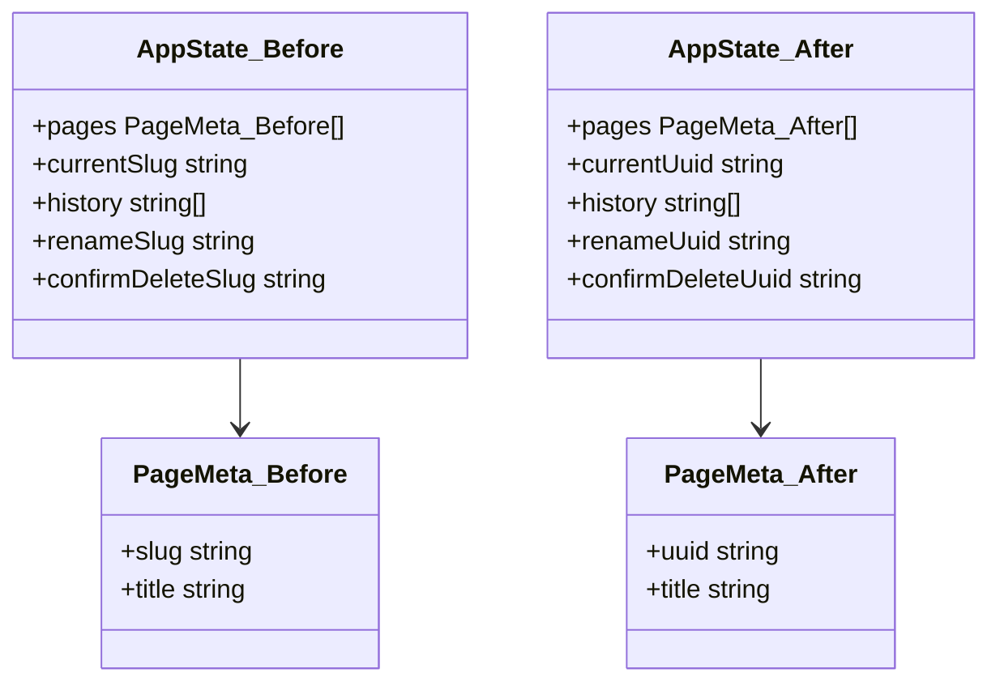
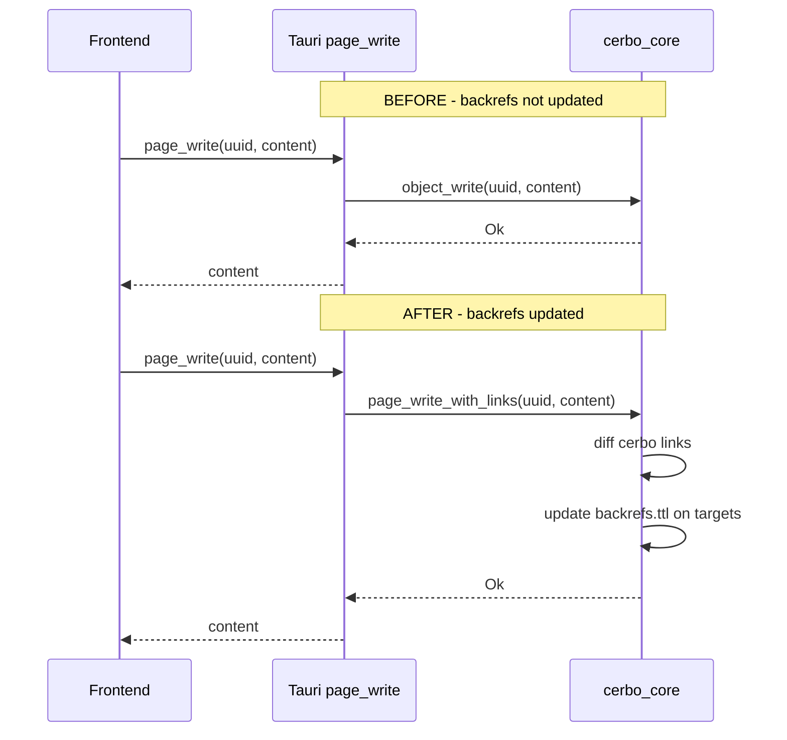
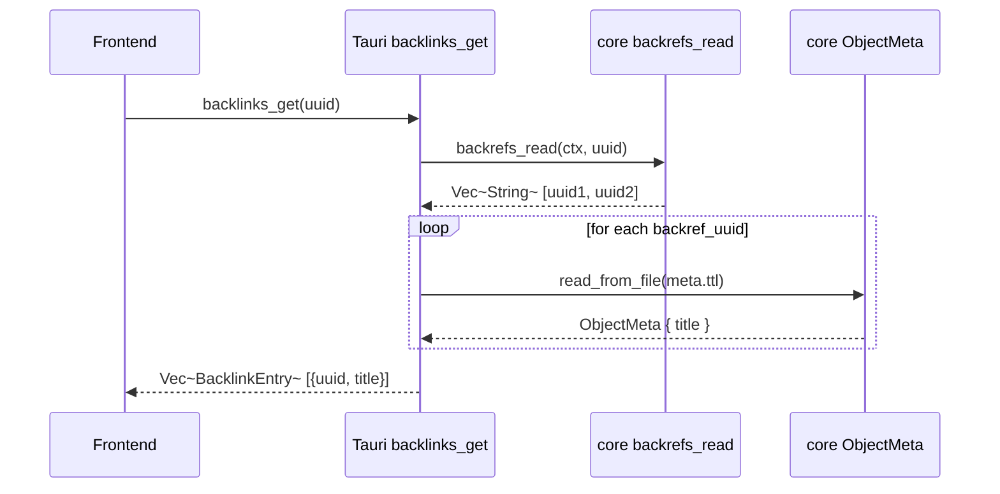
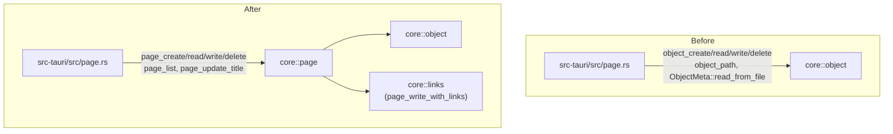
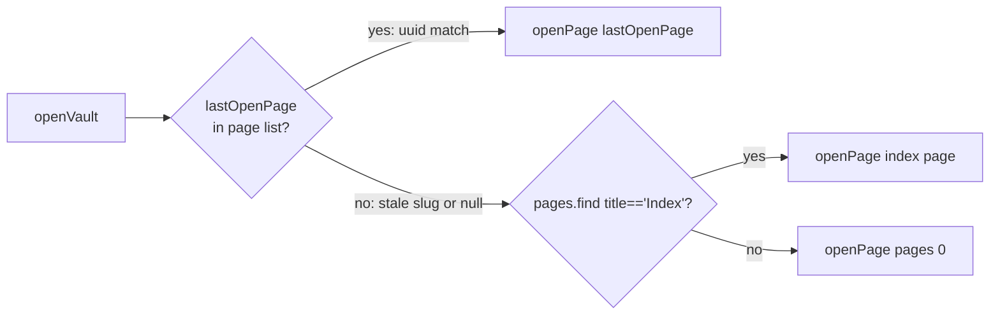

## Context

The `core` crate migrated to UUID object storage (`.cerbo/objects/<uuid>/`). The `cerbo-desktop` Tauri + SvelteKit layer was partially updated — Rust command implementations switched to `object::*` APIs — but the frontend `stores.svelte.ts` and the Tauri command signatures still use `slug` as the page identifier throughout. This creates a full contract mismatch between the frontend and backend.

Additionally two files (`src-tauri/src/rename.rs`, `src-tauri/src/slug.rs`) are dead code — they are not declared with `mod` in `lib.rs` and the `cerbo_core::rename` module they reference does not exist.

A secondary issue: `page_write` calls `object_write` directly, skipping `page_write_with_links`, so backrefs are never updated when pages are saved from the desktop.

## Goals / Non-Goals

**Goals:**
- Replace `slug` with `uuid` as the primary page identifier in all frontend state, history, `invoke()` calls, and Svelte components
- Fix `page_write` to route through `page_write_with_links` so backref tracking works
- Fix `backlinks_get` to return `{ uuid, title }` entries (currently returns raw `Vec<String>`)
- Add `page_update_title(uuid, newTitle)` Tauri command to replace the dead slug-based rename
- Remove dead code: `rename.rs`, `slug.rs`
- Route Tauri page commands through `cerbo_core::page::*` rather than `object::*` directly
- Handle stale `lastOpenPage` values (slugs from old sessions) gracefully

**Non-Goals:**
- Implementing cursor position persistence (stays stubbed)
- Implementing `attachment_upload` (stays stubbed)
- Implementing the FS watcher (stays stubbed)
- Changing the data on disk (no migration needed — core already writes UUID layout)
- Adding slug display or slug editing to the desktop UI

## Decisions

### 1. Frontend identifier: `uuid` replaces `slug` everywhere

`PageMeta` changes from `{ slug, title }` to `{ uuid, title }`. All reactive state, history array, and `app.current*` fields rename accordingly. All `invoke()` call sites pass `uuid` instead of `slug`.

The Tauri `page_list` command already returns `{ uuid, title }` from the Rust side — the mismatch is purely in the TypeScript type and the field name used downstream.

**Alternative considered**: Keep `slug` in `PageMeta` as an alias for `uuid` to minimise diff. Rejected — it perpetuates the wrong mental model and would require a second cleanup pass.

### 2. page_write must call page_write_with_links

Currently `page_write` in Tauri calls `object_write` directly. `page_write_with_links` reads the old content, diffs cerbo-links, and updates `backrefs.ttl` on the target objects. Without this, backlinks never update.

### 3. backlinks_get returns resolved entries

`backlinks_get` currently returns `Vec<String>` (raw UUIDs). The frontend types it as `BacklinkEntry[]` and tries to render `entry.slug` — which is always `undefined`. The fix: resolve each UUID to `{ uuid, title }` in the Tauri command before returning.

Resolution reads `meta.ttl` for each backlink UUID. This is cheap (small list, local disk).

### 4. page_rename → page_update_title

The old `page_rename` command (slug-based) is already dead — `rename.rs` is not declared in `lib.rs` and `cerbo_core::rename` does not exist. In the UUID model, "renaming" only means updating the `title` field in `meta.ttl`. There is no filename to change.

New command: `page_update_title(uuid: String, newTitle: String) -> Result<(), String>`

Implementation: read `meta.ttl`, update `:title`, write back. No cascade or index rebuild needed — `page_list` reads meta.ttl live.

**Alternative considered**: Expose this as part of `page_write` by parsing the `# Title` from content. Rejected — it couples content editing to metadata mutation and is fragile if the heading is absent.

### 5. Route Tauri page commands through cerbo_core::page

`src-tauri/src/page.rs` currently imports `cerbo_core::object::*` and reimplements logic already in `cerbo_core::page`. The fix is to import `cerbo_core::page` and delegate to it. This removes duplicated scanning logic and ensures Tauri picks up future core improvements automatically.

### 6. Stale lastOpenPage handling

`state.toml` stores `lastOpenPage` as a string. Existing sessions may have slugs there. After this change the desktop only stores UUIDs. On vault open, if the stored `lastOpenPage` value does not match any `page.uuid` in the list, fall back silently to the first available page (existing fallback already handles this case — no extra code needed).

## Risks / Trade-offs

| Risk | Mitigation |
|------|-----------|
| `page_write_with_links` reads old content before writing — extra disk read per save | Acceptable: local disk, small files, called only on explicit save |
| `backlinks_get` reads N meta.ttl files — O(backlinks) disk reads per page open | Acceptable: backlink counts are small; no caching needed at this stage |
| Svelte component files reference `currentSlug`, `renameSlug`, `confirmDeleteSlug` directly — easy to miss one | Rename all at once with a single search/replace pass; TypeScript will flag remaining `slug` references that don't type-check |
| Frontend history array stores UUIDs — old saved `lastOpenPage` slugs won't match | Handled by fallback logic (Decision 6) |

## Migration Plan

This is a code-only change; no data migration is needed. The disk layout is already UUID-based.

1. Update `core/src/page.rs` — add `page_update_title`, route `page_write` through `page_write_with_links`
2. Update `src-tauri/src/page.rs` — import `cerbo_core::page`, delete `object::*` imports, fix all command bodies
3. Update `src-tauri/src/index.rs` — fix `backlinks_get` return type and resolution
4. Update `src-tauri/src/vault.rs` — rename `slug` param to `uuid` in `vault_update_last_page`
5. Add `page_update_title` to `src-tauri/src/lib.rs` invoke handler; remove `page_rename` registration (already absent)
6. Delete `src-tauri/src/rename.rs` and `src-tauri/src/slug.rs`
7. Update `src/lib/stores.svelte.ts` — rename types, state fields, and all invoke call sites
8. Update all Svelte components — search/replace `slug` → `uuid`, `currentSlug` → `currentUuid`, etc.
9. TypeScript compile check to catch remaining mismatches

Rollback: revert commits. No schema changes, no DB migrations.

## Open Questions

- Should `page_update_title` also update the `# Title` heading in `page.md`? (Current `object_write` does update it; keeping them in sync needs a decision before the specs phase.)
- Is `slug_from_title` still needed anywhere outside the desktop (e.g. CLI tests that invoke it indirectly)? Verify before deleting `core/src/slug.rs`.
