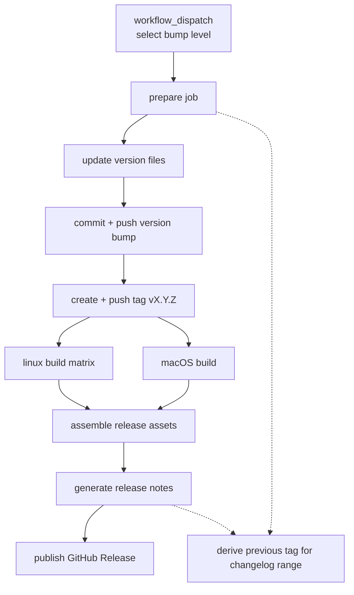

## Overview

This release workflow is a manual GitHub Actions pipeline that bumps Cerbo's version, creates a tag, builds Linux and macOS release artifacts, generates release notes from merged PRs, and publishes a GitHub Release. The goal is a repeatable release path that keeps version metadata and published assets aligned.

## Workflow Shape

## Architecture

The workflow should be split into a small number of clearly separated jobs:

- `prepare`: resolves the next semantic version from the manual bump input, updates version-bearing files, commits the bump, and pushes both commit and tag.
- `build-linux`: checks out the pushed tag and builds `tgz`, `AppImage`, `deb`, and `rpm` artifacts on Ubuntu.
- `build-macos`: checks out the pushed tag and builds the `dmg` artifact on macOS.
- `release`: downloads all artifacts, generates release notes, and publishes the GitHub Release for the tag.

The release should be tag-centered. Everything downstream uses the pushed tag as the immutable release identity so the workflow is not dependent on transient runner state.

Each job should set `timeout-minutes: 20` to keep release runs bounded and fail fast if packaging or publication hangs.

## Versioning

Cerbo currently stores version data in multiple places, so the release workflow needs one authoritative version value for the run and a sync step that updates all version-bearing files together. The release version should be derived from the selected bump level and the latest tag, then written before tagging so the repository state matches the published release.

Files that need to stay aligned include:

- `Cargo.toml` workspace members' package manifests
- `src-tauri/tauri.conf.json`
- `package.json`
- `nix/pkgs.nix`

## Changelog Generation

Release notes should be generated from merged PRs between the previous tag and the new tag. The workflow can query GitHub for PRs in the comparison range, pass the titles and bodies to the LLM, and produce a short release summary.

Fallback behavior should be simple:

- If PR metadata is available, use titles plus descriptions.
- If PR metadata is incomplete, fall back to commit messages in the tag range.

## Publishing

The final release job should create or update the GitHub Release for the tag and upload all artifacts to the same release record. The release body should include brief installation instructions for:

- Nix-based systems for both CLI and desktop builds
- Debian-based systems
- Red Hat-based systems
- macOS

The instructions should distinguish between the `cerbo` CLI and `cerbo-desktop` app so users know which artifact to install.

## Security and Reliability

- Use minimal GitHub token permissions, with write access only where commit/tag/release publication requires it.
- Use concurrency control so only one release run for a ref can proceed at a time.
- Add explicit 20 minute job timeouts to avoid stuck release runs.
- Keep the prepare step deterministic so the tag, version files, and artifacts all reference the same version.

## Open Questions

- Whether the Linux `tgz` should package only the CLI binary or both CLI and desktop assets.
- Whether release notes should be generated directly from GitHub API PR data or through an intermediate extraction script.
