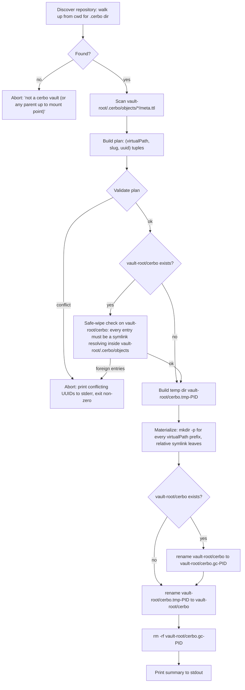

## Context

The proposal formalises the **cerbo vault** concept — any directory containing `.cerbo/`, discovered git-style by walking up from cwd — and defines `cerbo symlink` as a derivation that runs strictly inside such a repository. It takes the object store at `<vault-root>/.cerbo/objects/<uuid>/` and projects it into a human-readable directory tree at the fixed path `<vault-root>/cerbo/`, using each page's `:virtualPath` (real directories) and `:slug` (leaf symlink). Because both source and destination always live inside the same repository, every leaf symlink is a relative path; the entire repository directory remains self-contained and portable.

The conceptual model is borrowed from Nix's `pkgs.buildEnv`: the symlink tree is a throwaway view rebuilt from scratch, and switching it into place is an atomic rename. The analogy is **loose, not literal** — unlike Nix store paths, cerbo's object directories are NOT immutable (their `page.md` and `meta.ttl` change as the user edits). What we borrow from Nix is the *projection algorithm* (real dirs for merge points, symlinks at leaves, build-temp-then-swap), not the content-addressed immutability story.

This design pins down the algorithm, the metadata representation, the slug generator, the repository-discovery rule, and the safety rules around wiping a previous tree — so the implementation in the `cli` and `core` crates can proceed unambiguously.

Current state to build on:
- `core/src/object.rs` already parses/serializes `meta.ttl` via `rio_turtle`.
- `core/src/metadata_index.rs` already implements repository-wide scans (the `cerbo index` backend).
- `core/src/vault.rs` already implements vault registration and lookup; **repository discovery by walking up from cwd does NOT yet exist** and must be added as a public helper (`find_vault_root(cwd) -> Option<PathBuf>`), reusable across commands.
- The CLI uses `clap` derive in `cli/src/main.rs`.
- No slugification dependency exists; `unicode-normalization` is already in the tree.

## Goals / Non-Goals

**Goals:**
- Define the exact algorithm for building the symlink tree, mirroring Nix `buildEnv` semantics (real dirs for merge points, symlinks at leaves, abort on collision).
- Make every run idempotent and atomic: build into a temp directory, atomically swap into place, no partial states visible to other processes.
- Define `:slug` and `:virtualPath` Turtle representation, normalization rules, and uniqueness constraints.
- Pick the slug generator and document why.
- Define the "safe wipe" rule that prevents `cerbo symlink` from ever destroying user data sitting at the target path.
- Spell out cross-platform symlink concerns up front.

**Non-Goals:**
- Watcher / incremental rebuild (covered as non-goal in the proposal).
- Reverse sync (covered as non-goal in the proposal).
- Generation history à la `nix-env --rollback`. We replace the tree in place; we don't keep `<vault>-1`, `<vault>-2`. May be revisited later.
- Auto-suffixing of colliding slugs. The proposal had a leftover line about "deterministic suffix" resolution; we explicitly REPLACE that with Nix-style hard abort. Collisions are user-fixable data errors, not something the tool papers over silently. See Decision 6.

## Decisions

### 1. Build algorithm: Nix `buildEnv`-style two-phase, atomic swap



ASCII fallback:

```
0. Discover repo: walk-up from cwd for .cerbo/. Abort if none.
1. Output dir is always: <vault-root>/cerbo/
2. Scan <vault-root>/.cerbo/objects/*/meta.ttl, collect (uuid, slug, virtualPath)
3. Build plan; validate (see Decision 6)
4. If <vault-root>/cerbo/ exists: safe-wipe check (Decision 5)
5. Build full tree in <vault-root>/cerbo.tmp-<pid>/ with relative symlinks
6. rename <vault-root>/cerbo/ -> <vault-root>/cerbo.gc-<pid>/   (if it existed)
7. rename <vault-root>/cerbo.tmp-<pid>/ -> <vault-root>/cerbo/
8. rm -rf <vault-root>/cerbo.gc-<pid>/
```

**Why two renames instead of one:** POSIX `rename(2)` only atomically replaces an EXISTING target if both are the same type AND the target is empty (for directories on some kernels) or if `renameat2(RENAME_EXCHANGE)` is used (Linux-only). To stay portable we use the well-known temp+gc pattern: window of inconsistency is ~milliseconds, and a crash leaves either the old tree or `<vault-root>/cerbo.gc-<pid>/` for a follow-up GC sweep. Nix uses the same trick at the profile-symlink level [Perplexity §4 — sandervanderburg, edolstra/atomic-hotswup].

**Alternative considered:** Build in place. Rejected — any failure mid-rebuild would leave a half-materialized tree that the next run might not recognise as "ours" (since some symlinks may already exist while others are missing or stale).

### 2. Symlink target form: always relative

Every leaf symlink uses a **relative** path of the form `../../<...>/.cerbo/objects/<uuid>/`, with the exact number of `..` segments determined by the leaf's depth under `<vault-root>/cerbo/`. Specifically: from a leaf at `<vault-root>/cerbo/<virtualPath>/<slug>`, the target climbs `1 + depth(virtualPath) + 1` levels to reach `<vault-root>/`, then descends into `.cerbo/objects/<uuid>/`.

The leaf symlink points at the OBJECT DIRECTORY (not `page.md`).

**Why always relative:** because the cerbo-repository rule (Decision 7) guarantees the output tree lives inside the same repository as `.cerbo/objects/`, both endpoints are anchored under the same root. Relative paths make the entire repository directory **self-contained and portable** — `mv` the whole repo to a new location (USB drive, different host, archived backup, renamed parent dir) and every symlink keeps resolving. Absolute paths would break on every such move and serve no purpose here.

This is a simplification over an earlier draft that considered an absolute-path fallback for the "tree outside the vault" case; the cerbo-repository rule eliminates that case entirely.

**Implementation note:** use `pathdiff::diff_paths` (or equivalent) to compute the relative form; both the symlink's containing directory and the target are known absolute paths, so this is mechanical.

**Why target the directory, not `page.md`:** matches Nix `buildEnv` — symlinks point at the "package", not into it. Lets users `cd` into a slug and find `meta.ttl`, `backrefs.ttl`, etc. The directory listing in an editor shows the page alongside its sidecar metadata.

**Trade-off:** double-clicking a slug in a file manager opens the directory, not the markdown file. Acceptable; users who want one-click open can run their editor on `<slug>/page.md` or alias it.

**Safe-wipe interaction:** the safe-wipe check (Decision 5) `readlink`s and canonicalises each entry before verifying its target lives under `<vault-root>/.cerbo/objects/`. Canonicalisation handles relative symlinks naturally — no additional logic required.

### 3. Slug generator: the `slug` crate (transliteration via `deunicode`) + project-local length cap

We add the [`slug`](https://crates.io/crates/slug) crate to `core`. It is small, deterministic, ASCII-output, internally backed by `deunicode` for Unicode-to-Latin transliteration, and produces kebab-case directly. We add a project-local wrapper that:

- caps length at **80 chars** (truncate on a `-` boundary if possible),
- falls back to `untitled-<first-8-of-uuid>` if the input slugifies to empty,
- forces lowercase,
- never emits a trailing `-` after truncation.

**Alternatives considered:**
- Build the pipeline ourselves on top of `deunicode`: more control, but the `slug` crate already does the right thing and is widely used. Not worth the maintenance burden [Perplexity §slug recommendation].
- `slugify` crate: comparable but slightly less popular; `slug`'s API is dead-simple. Either would work.

### 4. Metadata representation: two independent Turtle triples in `meta.ttl`

```turtle
@prefix cerbo: <https://cerbo.app/ns#> .
@prefix : <#> .

<> a cerbo:Page ;
   cerbo:title "Rust Ownership" ;
   cerbo:slug "rust-ownership" ;
   cerbo:virtualPath "notes/rust" ;
   schema:dateCreated "2026-05-18T10:00:00Z"^^xsd:dateTime .
```

- `cerbo:slug` — string, kebab-case ASCII, no `/`, no leading/trailing `-`, 1..=80 chars.
- `cerbo:virtualPath` — string, POSIX-style relative path, no leading or trailing `/`, no `.` or `..` segments, no empty segments, no NULs. Empty string (or missing predicate) means "vault root".
- Both are **independent** predicates: changing one does not constrain the other. They are NOT a compound key in TTL; the **rendered path** `virtualPath + "/" + slug` is what must be unique vault-wide.

**Why the `cerbo:` prefix and not e.g. `schema:`:** `schema.org` has no semantic for "this is where the symlink should live"; this is a cerbo-specific filesystem concern. Reusing the existing `cerbo:` namespace keeps it local.

### 5. Safe-wipe rule

Before we touch `<vault-root>/cerbo/`, we walk it and verify EVERY entry is one of:
- a directory containing only safe entries (recursive), OR
- a symlink whose `readlink` target, canonicalised, starts with `<vault-root>/.cerbo/objects/`.

If we encounter a regular file, a symlink pointing anywhere else (including into a *different* repository's `.cerbo/`), a device node, etc., we abort with an error listing the offending path(s). We **never** rely on a marker file (e.g. `.cerbo-symlink-tree`) — it could be deleted, leaving the tool unsure. Origin-of-target is the authoritative signal.

**Alternative considered:** Marker file at root of the symlink tree. Rejected for the reason above; users delete things and we shouldn't have a footgun.

**Trade-off:** if the user has a symlink to a different cerbo vault's `.cerbo/objects/` inside the tree, we'd refuse to wipe. Acceptable — that's almost certainly user data we shouldn't touch.

### 6. Conflict policy: hard abort, no auto-suffix

Conflicts:
- **Leaf-vs-leaf**: two pages produce the same `virtualPath/slug`.
- **Dir-vs-leaf**: page A has `virtualPath="notes"`, `slug="rust"`, and page B has `virtualPath="notes/rust"`, `slug=anything`. The path `notes/rust` would have to be both a symlink and a real directory. This includes the degenerate case where one page's virtualPath equals another page's virtualPath/slug.

On conflict, abort the rebuild, print a report listing the colliding paths and the UUIDs involved, exit non-zero. The pre-existing tree on disk is left untouched (we never started touching it).

**Why no auto-suffixing:** Nix uses hard collision-abort by default for the same reason — silent disambiguation creates surprise renames between runs ("yesterday it was `lifetimes`, today it's `lifetimes-2`?") and hides real user errors. The `cerbo index` command will detect and report these so users fix them at the source (by editing slug or virtualPath in `meta.ttl`).

**This supersedes** the proposal line that mentioned "deterministic suffix" resolution. The proposal will be updated accordingly when specs are written.

### 7. Repository discovery: mandatory walk-up for `.cerbo/`

`cerbo symlink` takes no positional arguments. It always runs against the cerbo vault that contains cwd:

1. Walk from cwd toward `/` looking for a directory that contains a `.cerbo/` subdirectory. Stop at the first match — that's the vault root.
2. Stop early at mount-point boundaries to avoid walking out of the user's filesystem (matches git behavior; controlled by `stat::st_dev` change between cwd and parent).
3. If no `.cerbo/` is found before reaching `/` or a mount point, abort with: `not a cerbo vault (or any parent up to mount point)`. The wording deliberately mirrors `git`'s `fatal: not a git repository (or any parent up to mount point /)`.

The discovery helper is `core::vault::find_vault_root(cwd: &Path) -> Option<PathBuf>`, designed to be reused by future commands (`cerbo create`, `cerbo index` with no `--vault`, etc.). Existing vault registration in `core::vault` is **not** consulted by `cerbo symlink` — the repository concept is cwd-relative and self-evident from `.cerbo/` presence, not from a global registry.

**Output directory name** is the fixed string `cerbo` (e.g. repo at `/home/anton/my-notes` → tree at `/home/anton/my-notes/cerbo/`). Rationale: predictable across all repositories (muscle memory: `cd cerbo`), no redundant nesting like `my-notes/my-notes/`, trivial to `.gitignore` (`/cerbo/`), and `cerbo` is a project-specific name unlikely to collide with unrelated user content. If a user happens to have an unrelated `cerbo/` directory at the repo root, the safe-wipe check (Decision 5) will refuse to touch it — they get a clear error, not data loss.

**Alternative considered:** Accepting an explicit vault name and looking it up against the global registry (`cerbo vault list`). Rejected — that mode mixes "the current repo" with "any registered repo", which is the same confusion that made early git's `--git-dir` flag awkward. Keeping `cerbo symlink` strictly cwd-relative matches user mental model.

### 8. `cerbo init` writes a `.gitignore` entry for `/cerbo/`

`cerbo init` SHALL ensure that a `.gitignore` file exists at the vault root and contains a line `/cerbo/` (rooted to the repo, so it never matches a nested `cerbo/` deeper in the tree). Behavior:

- If no `.gitignore` exists: create one containing `/cerbo/\n`.
- If `.gitignore` exists and already contains `/cerbo/` (exact match on a line): no-op.
- If `.gitignore` exists but does NOT contain `/cerbo/`: append a section with a one-line comment `# Cerbo symlink tree (regenerate with: cerbo symlink)` and the `/cerbo/` line.

**Why:** the materialised tree is a derived artifact (regeneratable from `.cerbo/objects/`) and committing it would (a) bloat the repo, (b) make diffs noisy on every rebuild, (c) embed absolute-or-relative symlinks into git which behaves poorly on case-insensitive checkouts and on Windows. The user almost always wants the tree but never wants it tracked.

**Why rooted (`/cerbo/`) and not bare (`cerbo`):** the rooted form matches ONLY the directory at the repo root, not any nested `cerbo/` directory that might exist as legitimate content elsewhere in the repo (e.g. a page about cerbo itself).

**Idempotency:** Re-running `cerbo init` on an existing repo is already a no-op for `.cerbo/`; this rule preserves that property for `.gitignore` (only append if missing).

**Scope:** this only affects `cerbo init`. `cerbo symlink` does NOT modify `.gitignore` — it relies on `cerbo init` having done so, or on the user having added it manually. (Documented in the `cerbo symlink --help`.)

### 9. Indexer integration

`cerbo index` already scans all `meta.ttl` files. Extend it to:
- Backfill `cerbo:slug` from `cerbo:title` if missing (writes back to disk).
- Validate `cerbo:virtualPath` shape (normalization rules above); report invalid values, do NOT auto-fix.
- Detect and report combined-path collisions (same logic as the symlink command's pre-build validation).

This means a `cerbo index` run before `cerbo symlink` is sufficient to guarantee `cerbo symlink` succeeds.

## Risks / Trade-offs

- **Windows symlinks require Developer Mode or admin** → Mitigation: detect the error class from `std::os::windows::fs::symlink_dir`/`symlink_file`, emit a one-line install hint pointing at MS docs. The CLI is Linux/macOS-first; Windows is best-effort for now.
- **Case-insensitive filesystems (default macOS, Windows)** → two slugs differing only in case collide on disk even when they're distinct in `meta.ttl` → Mitigation: forced-lowercase slugs (Decision 3) sidesteps this entirely.
- **Slug auto-backfill rewrites `meta.ttl`** → may surprise users running `cerbo index` for the first time after upgrading → Mitigation: print a per-page log line when backfilling; add `--no-backfill-slug` flag for users who want index to be read-only.
- **Large vaults (≥10k pages)** → full meta.ttl scan on every `symlink` run → Mitigation: not optimising now; if it becomes painful, cache the (uuid → slug, virtualPath) map in `.cerbo/index.json` and invalidate by mtime.
- **Two-rename window is not strictly atomic** → another process reading the tree could see it disappear briefly → Mitigation: documented in `--help`; treat the symlink tree as "rebuilds occasionally", not a hot real-time API.
- **Empty slug after transliteration** (e.g. title is only emoji) → fallback to `untitled-<uuid-prefix>` (Decision 3). Acceptable; the user can manually set a meaningful slug.

## Migration Plan

This is additive. Existing vaults work unchanged:
1. Land metadata extensions (`cerbo:slug`, `cerbo:virtualPath`) — pages without them are valid; treated as `slug = slugify(title)`, `virtualPath = ""` at read time.
2. Land `cerbo index` backfill so users can opt into persisting slugs.
3. Land `cerbo symlink` command.
4. No data migration required. Old vaults can run `cerbo symlink` immediately; slugs will be derived on the fly from titles.

**Rollback:** the symlink tree is a derived artifact — delete `<vault-name>/` and nothing of value is lost. The metadata extensions are additive Turtle triples; removing the code that reads them leaves `meta.ttl` files with harmless extra predicates.

## Open Questions

- **Hidden objects** (e.g. ontology objects shipped by `cerbo init`): do we expose them too? Probably hide by default (e.g. when `meta.ttl` has `type: :Ontology`), with `--include-ontologies` to opt in. Specs will pin this down.
- **`cerbo symlink --output <dir>` override:** could let users place the tree outside the repo (e.g. `~/notes-view/`). Rejected for v1 — it reintroduces the absolute-vs-relative-target complexity we just eliminated, and the "always inside the repo at `cerbo/`" rule is what makes the repo portable. Revisit only if there's strong demand.

## References

- Nix `buildEnv` algorithm and atomic profile-build behavior — Perplexity research: `pkgs/build-support/build-env/build-env.pl`; Sander van der Burg "Managing user environments with Nix" (http://sandervanderburg.blogspot.com/2013/09/managing-user-environments-with-nix.html); Dolstra "Atomic Hot-swapping" (https://edolstra.github.io/pubs/atomic-hotswup2008-final.pdf).
- Slug crate selection — Perplexity comparison of `slug` / `slugify` / `deunicode` (https://crates.io/crates/slug, https://crates.io/crates/deunicode).
