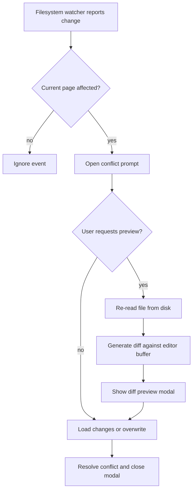

## Context

The current external-change dialog is a small binary confirmation modal: load the disk version or overwrite it with the editor version. That is enough to resolve conflicts, but it does not let the user inspect the actual delta before choosing.

This change adds an on-demand diff preview path for filesystem conflicts. The diff must be generated from the live disk file and the current in-memory editor buffer, not from git state. The preview is also intended to remain compatible with later git-backed history views, so the design should keep diff generation and diff rendering loosely coupled.

## Goals / Non-Goals

**Goals:**
- Let the user request a diff preview from the external-change modal.
- Re-read the file from disk when preview is requested so the diff is current.
- Render the preview in a larger diff-focused modal.
- Keep the existing actions available from the diff view so the user can approve the disk version or keep the editor version.
- Keep the diff format suitable for later reuse with git-backed workflows.

**Non-Goals:**
- Do not introduce git repository operations yet.
- Do not make the conflict dialog always open in preview mode.
- Do not redesign page editing or background sync behavior outside this conflict flow.

## Decisions

### 1. Use a two-step modal flow

The conflict starts as the existing lightweight confirmation dialog. Preview is an explicit second state, not the default.

Rationale: the prompt remains fast and familiar, while the preview is only paid for when needed.

Alternatives considered:
- Always show the diff first. Rejected because it adds friction to the common case.
- Open a separate page or drawer. Rejected because the conflict is still the same decision and should stay local to the modal.

### 2. Re-read disk content on preview request

The preview should use the file contents at the moment the user asks for it, not a snapshot captured when the conflict first arrived.

Rationale: this matches the requirement for realtime inspection and avoids stale diffs if the file changes again while the dialog is open.

Alternatives considered:
- Snapshot on event arrival. Rejected because it can drift from disk.
- Poll while the modal is open. Rejected because it is more complex than needed for this feature.

### 3. Keep diff generation separate from modal rendering

The UI should consume a standard unified diff string, but it should not care how that string was produced.

Rationale: this keeps the preview renderer compatible with later git-backed history views and makes the diff source swappable.

Alternatives considered:
- Render line-by-line editor state directly. Rejected because it couples the UI to one diff source and makes future git integration harder.
- Hard-code a single diff library into the component. Rejected because the component should stay focused on presentation.

### 4. Preserve the existing action semantics in preview mode

The diff view keeps the same bottom actions as the prompt: `Load changes` and `Overwrite`.

Rationale: the user should not have to re-learn the conflict decision once they enter preview.

Alternatives considered:
- Rename actions to `Approve` and `Reject`. Rejected for now because the current app already uses the existing wording.

### 5. Keep the preview surface visually compact and opaque

The expanded preview should keep the conflict icon and title on one horizontal row, use an opaque modal surface above the rest of the app, and avoid redundant refresh controls once the diff is visible.

Rationale: the preview should read like the same conflict dialog in a larger presentation, not as a separate control panel.

Alternatives considered:
- Stack the title under the icon. Rejected because it makes the header taller than needed.
- Keep a refresh button in the preview. Rejected because the preview is already generated on demand from live disk content.

## Risks / Trade-offs

- Re-reading disk on preview → The preview can differ slightly from the original event if the file changes again. Mitigation: this is intentional and should be visible.
- Larger modal surface → The expanded diff view may feel heavier than the current prompt. Mitigation: keep the preview optional and preserve the default prompt path.
- Diff format drift → If the diff source changes later, the renderer could break. Mitigation: standardize on a unified diff string boundary between generation and rendering.

## Migration Plan

1. Extend the existing conflict dialog with a preview state.
2. Add a disk-read + diff-generation path that runs only when preview is requested.
3. Render the diff in the expanded modal while keeping the existing actions available.
4. Keep the current prompt flow intact as the default entry point.
5. Later, swap the diff generator behind the same boundary when git-backed features arrive.

## Open Questions

- Which unified-diff generator should back the preview path once implementation starts?
- Should the preview preserve the exact current action labels or adopt more explicit diff-view language later?
