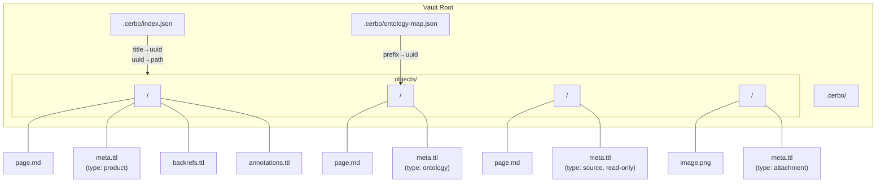
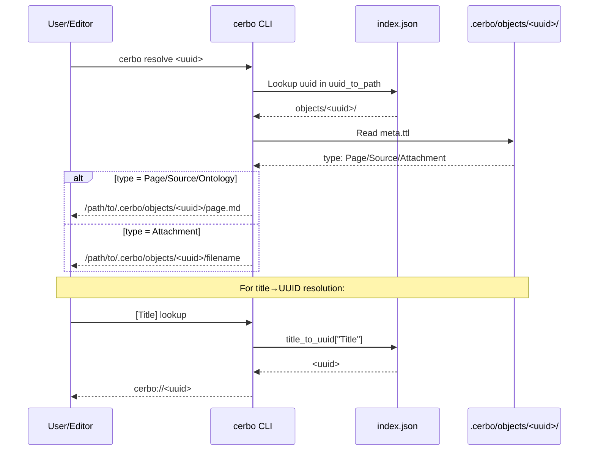
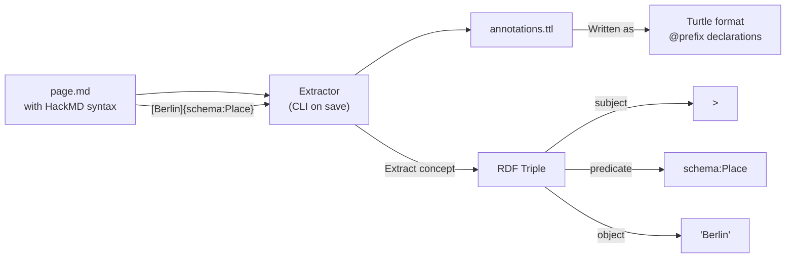

## Context

Cerbo currently uses a slug-based storage model where pages are stored as `<vault-root>/<slug>/page.md`. The slug is derived from the page title, coupling identity to presentation. This design introduces a UUID-based object storage model where all content (pages, attachments, ontologies) are stored as objects under `.cerbo/objects/<uuid>/`.

**Current State:**
```
Vault Root/
├── rust-ownership/
│   └── page.md
├── svelte-guide/
│   ├── page.md
│   └── assets/
└── .cerbo/          ← only config/state (if exists)
```

**Target State:**
```
Vault Root/
└── .cerbo/
    ├── ontology-map.json
    └── objects/
        ├── <uuid-1>/
        │   ├── page.md
        │   ├── meta.ttl
        │   ├── backrefs.ttl
        │   └── annotations.ttl
        └── <uuid-2>/
            ├── image.png
            └── meta.ttl
```

**Constraints:**
- Must be local-first (no external dependencies at runtime)
- Rust/Tauri/Svelte stack
- Breaking change by design (no migration for existing vaults)
- Ontologies are first-class objects (recursive design)

**Stakeholders:**
- CLI users (primary interface for vault management)
- Desktop app users (editor renders `cerbo://` links and HackMD annotations)
- Future: SPARQL queriers (via Oxigraph)

## Goals / Non-Goals

**Goals:**
- Decouple object identity (UUID) from display (title)
- Enable machine-readable semantic annotations via HackMD syntax
- Lay foundation for RDF triple store (Oxigraph) with SPARQL queries
- Make ontologies first-class objects (importable, extensible)
- Provide fast title→UUID resolution via index.json

**Non-Goals:**
- Editor behavior (how the Svelte editor resolves titles to UUIDs)
- Search functionality (full-text search, semantic search)
- Migration tools for existing slug-based vaults
- Multi-device sync or collaboration features
- SPARQL endpoint implementation (Phase 2, with Oxigraph)

## Decisions

### Decision 1: UUID v4 for Object Identifiers

**Choice:** Use UUID v4 (random) for all object identifiers.

**Rationale:**
- No central coordination needed (unlike sequential IDs)
- No information leakage (can't guess neighboring IDs)
- Well-supported in Rust (`uuid` crate)
- Appropriate for ~10,000 documents (validated by Perplexity)

**Alternatives Considered:**
- **ULID**: Sortable by time, but adds dependency and coupling to creation time
- **Nanoid**: Shorter, but less standard in Rust ecosystem
- **Hash-based (SHA-256 of content)**: Content-addressable, but makes updates complex

**Implementation:**
```rust
use uuid::Uuid;
let object_id = Uuid::new_v4().to_string();
```

---

### Decision 2: Turtle (.ttl) for RDF Serialization

**Choice:** Use Turtle format for `meta.ttl`, `backrefs.ttl`, `annotations.ttl`.

**Rationale:**
- W3C standard (https://www.w3.org/TR/turtle/)
- Human-readable compared to RDF/XML
- Native support in Oxigraph (future phase)
- Compact syntax for RDF triples

**Alternatives Considered:**
- **JSON-LD**: More familiar to web developers, but less mature in Rust RDF libraries
- **RDF/XML**: Standard but verbose and hard to edit manually
- **N-Triples**: Simpler but verbose for common use cases

**Example `meta.ttl`:**
```turtle
@prefix : <cerbo://ontology/> .
@prefix schema: <cerbo://objects/<uuid-schema-org>> .

<cerbo://objects/<uuid-page>>
    :type :Page ;
    :title "My Page" ;
    schema:dateCreated "2026-05-04T10:00:00Z"^^xsd:dateTime ;
    schema:dateModified "2026-05-04T10:00:00Z"^^xsd:dateTime .
```

---

### Decision 3: HackMD Semantic Markdown for Annotations

**Choice:** Use HackMD-style `[Text]{prefix:Type}` syntax for non-link semantic annotations.

**Rationale:**
- Inline, human-readable syntax
- Separate from links (doesn't create navigable links)
- Maps cleanly to RDF triples
- No interference with standard Markdown

**Syntax Specification:** https://hackmd.io/@sparna/semantic-markdown-draft

**Examples in `page.md`:**
```markdown
I visited [Berlin]{schema:Place} last summer.
[Alice]{foaf:Person} introduced me to [Programming]{:Concept}.
```

**Alternatives Considered:**
- **`{{Text|Type}}` double-brace**: Not a known standard
- **Frontmatter only**: Loses inline context
- **HTML comments `<!-- semantic: ... -->`**: Invisible to readers

**Extraction to `annotations.ttl`:**
```turtle
@prefix schema: <cerbo://objects/<uuid-schema-org>> .
@prefix foaf: <cerbo://objects/<uuid-foaf>> .
@prefix : <cerbo://ontology/> .

<cerbo://objects/<uuid-page>>
    :hasAnnotation [
        :concept "Berlin" ;
        :type schema:Place ;
        :position "28:34"
    ] ;
    :hasAnnotation [
        :concept "Alice" ;
        :type foaf:Person ;
        :position "58:69"
    ] .
```

---

### Decision 4: Ontologies as First-Class Objects

**Choice:** Ontologies (Schema.org, FOAF) are stored as `type: ontology` objects in `.cerbo/objects/<uuid>/`.

**Rationale:**
- Recursive design: ontologies follow the same storage pattern as pages
- Importable via `cerbo import-ontology <url>`
- Prefix mapping via `ontology-map.json`
- Extensible: users can add custom ontologies

**Storage of an ontology:**
```
.cerbo/objects/<uuid-schema-org>/
├── page.md              ← documentation content (e.g., Schema.org schema docs)
└── meta.ttl
    @prefix : <cerbo://ontology/> .
    <cerbo://objects/<uuid-schema-org>>
        :type :Ontology ;
        :title "Schema.org" ;
        schema:dateCreated "2026-05-04T..."^^xsd:dateTime ;
        :original-url "https://schema.org/docs/schemas.html" .
```

**Prefix Resolution:**
```json
// .cerbo/ontology-map.json
{
  "prefixes": {
    "schema": "<uuid-schema-org>",
    "foaf": "<uuid-foaf>"
  }
}
```

When user types `[Berlin]{schema:Place}`:
1. Read `ontology-map.json`
2. Resolve `schema:` → `<uuid-schema-org>`
3. Full predicate: `<cerbo://objects/<uuid-schema-org>>:Place`

---

### Decision 5: Index Strategy (JSON now, Oxigraph later)

**Choice:** Use `.cerbo/index.json` for Phase 1, migrate to Oxigraph embedded triple store for Phase 2.

**Phase 1 (Current): `.cerbo/index.json`**
```json
{
  "title_to_uuid": {
    "My Page": "<uuid-page-1>",
    "Svelte Docs": "<uuid-source-1>"
  },
  "uuid_to_path": {
    "<uuid-page-1>": "objects/<uuid-page-1>/",
    "<uuid-source-1>": "objects/<uuid-source-1>/"
  }
}
```

**Rationale for JSON:**
- Simple, fast lookups for title→UUID resolution
- No additional dependencies
- Easy to debug and edit manually

**Phase 2 (Future): Oxigraph Embedded Triple Store**
- Perplexity validation: Oxigraph is a reasonable choice for Rust SPARQL support
- Alternative considered: Sophia (more flexible, less opinionated, but no SPARQL)
- Oxigraph provides full SPARQL 1.1 query capabilities
- Data from `meta.ttl`, `backrefs.ttl`, `annotations.ttl` loaded into graph

**Oxigraph Migration Path:**
```
Phase 1:  JSON index + Turtle files (manual parsing)
             ↓
Phase 2:  Oxigraph embedded DB (.cerbo/oxigraph.db)
          - Load all .ttl files into graph
          - SPARQL queries for backlinks, concept search
          - Real-time graph updates on page save
```

**Reference:** [Oxigraph - Rust RDF Store](https://oxigraph.org/)

---

### Decision 6: Link Format `cerbo://<uuid>`

**Choice:** Use `cerbo://<uuid>` without `/page.md` or `/image.png` suffix.

**Rationale:**
- Type is determined by `meta.ttl` `type:` field
- Cleaner links in Markdown
- Client resolves to correct file based on type:
  - `type: Page/Source` → `<uuid>/page.md`
  - `type: Attachment` → `<uuid>/<filename>`
  - `type: Ontology` → `<uuid>/page.md`

**Examples in `page.md`:**
```markdown
[My Page](cerbo://<uuid-page-1>)

[Schema.org](cerbo://<uuid-schema-org>)
```

**Resolution Logic (`cerbo resolve <uuid>`):**
```rust
fn resolve_uuid(uuid: &str) -> Result<PathBuf, String> {
    let meta = read_meta_ttl(uuid)?;
    match meta.type {
        ObjectType::Page | ObjectType::Source | ObjectType::Ontology => {
            Ok(objects_dir().join(uuid).join("page.md"))
        }
        ObjectType::Attachment => {
            let filename = detect_attachment_filename(uuid)?;
            Ok(objects_dir().join(uuid).join(filename))
        }
    }
}
```

---

### Decision 7: Object Types and Read-Only Enforcement

**Choice:** Four object types with different behaviors.

| Type | `page.md` | Editable? | `original-url` | `mime-type` |
|------|------------|------------|----------------|-------------|
| `product` | ✓ | Yes | No | No |
| `source` | ✓ | **No** (read-only) | Yes | No |
| `attachment` | No (binary file) | Yes | No | Yes |
| `ontology` | ✓ | Yes | Yes | No |

**Read-Only Enforcement (for `type: source`):**
- **CLI**: `cerbo page write <uuid>` returns error for source types
- **CLI**: `cerbo page delete <uuid>` returns error for source types
- **Desktop**: Editor UI shows lock icon, disables editing

**Creation Commands:**
```bash
cerbo create "My Notes"        # type: product (default)
cerbo import <url>             # type: source (read-only)
cerbo import-ontology <url>    # type: ontology
# Attachments added via page attachment commands (existing)
```

---

## Architecture Diagrams

### Mermaid: Object Storage Architecture



### Mermaid: Link Resolution Flow



### Mermaid: HackMD Annotation Extraction



---

## Storage Layout (ASCII Documentation)

### Complete Directory Structure

```
Vault Root/
│
└── .cerbo/                           ← Vault root marker (created by `cerbo init`)
    │
    ├── index.json                     ← Fast lookups (title→uuid, uuid→path)
    │   {
    │     "title_to_uuid": {
    │       "My Page": "<uuid-1>",
    │       "Svelte Docs": "<uuid-2>"
    │     },
    │     "uuid_to_path": {
    │       "<uuid-1>": "objects/<uuid-1>/",
    │       "<uuid-2>": "objects/<uuid-2>/"
    │     }
    │   }
    │
    ├── ontology-map.json              ← Prefix → Ontology UUID mapping
    │   {
    │     "prefixes": {
    │       "schema": "<uuid-schema-org>",
    │       "foaf": "<uuid-foaf>"
    │     }
    │   }
    │
    └── objects/
        │
        ├── <uuid-schema-org>/            ← ONTOLOGY (bundled)
        │   ├── page.md                    ← Schema.org documentation content
        │   └── meta.ttl
        │       @prefix : <cerbo://ontology/> .
        │       <cerbo://objects/<uuid-schema-org>>
        │           :type :Ontology ;
        │           :title "Schema.org" ;
        │           :original-url "https://schema.org/docs/schemas.html" ;
        │           schema:dateCreated "2026-05-04T..." ;
        │           schema:dateModified "2026-05-04T..." .
        │
        ├── <uuid-foaf>/                 ← ONTOLOGY (bundled)
        │   ├── page.md
        │   └── meta.ttl
        │
        ├── <uuid-page-1>/               ← PRODUCT (user-created, editable)
        │   ├── page.md                   ← Contains [Text](cerbo://<uuid>) links
        │   ├── meta.ttl                  ← type: product, title, dates
        │   ├── backrefs.ttl             ← Incoming links (backlinks only)
        │   │   <cerbo://objects/<uuid-page-1>>
        │   │       :hasBacklink <cerbo://objects/<uuid-page-2>> .
        │   │
        │   └── annotations.ttl          ← HackMD [Text]{prefix:Type}
        │       <cerbo://objects/<uuid-page-1>>
        │           :hasAnnotation [
        │               :concept "Berlin" ;
        │               :type schema:Place
        │           ] .
        │
        ├── <uuid-source-1>/             ← SOURCE (imported, READ-ONLY)
        │   ├── page.md
        │   ├── meta.ttl                  ← type: source, original-url
        │   ├── backrefs.ttl
        │   └── annotations.ttl
        │
        └── <uuid-attachment-1>/         ← ATTACHMENT
            ├── image.png                 ← Binary file (any mime-type)
            └── meta.ttl                  ← type: attachment, mime-type
                @prefix : <cerbo://ontology/> .
                <cerbo://objects/<uuid-attachment-1>>
                    :type :Attachment ;
                    :title "image.png" ;
                    :mime-type "image/png" ;
                    schema:dateCreated "2026-05-04T..." .
```

### File Format Specifications

#### `meta.ttl` (Metadata - Turtle RDF)

```turtle
@prefix : <cerbo://ontology/> .
@prefix schema: <cerbo://objects/<uuid-schema-org>> .
@prefix xsd: <http://www.w3.org/2001/XMLSchema#> .

<cerbo://objects/<uuid>>
    :type :Page | :Source | :Attachment | :Ontology ;
    :title "Human-Readable Title" ;
    schema:dateCreated "2026-05-04T10:00:00Z"^^xsd:dateTime ;
    schema:dateModified "2026-05-04T10:00:00Z"^^xsd:dateTime .
    # For Source type:
    :original-url "https://example.com/page" .
    # For Attachment type:
    :mime-type "image/png" .
```

#### `backrefs.ttl` (Incoming Links / Backlinks - Turtle RDF)

```turtle
@prefix : <cerbo://ontology/> .

# ONLY backlinks (other objects that link TO this object)
# Outgoing links are in page.md as cerbo://<uuid> (no tracking file needed)

<cerbo://objects/<uuid-page>>
    :hasBacklink <cerbo://objects/<uuid-source-page>> ;
    :hasBacklink <cerbo://objects/<uuid-another-page>> .
```

**How it works:**
- Page A has `[Page B](cerbo://<uuid-b>)` in `page.md` (outgoing link)
- When Page A is saved, system updates `<uuid-b>/backrefs.ttl` with `:hasBacklink <cerbo://objects/<uuid-a>>`
- Page A does NOT store outgoing links in any .ttl file (just in page.md)
- `backrefs.ttl` is the "inbox" for this object - who links TO me?

#### `annotations.ttl` (HackMD Annotations - Turtle RDF)

```turtle
@prefix : <cerbo://ontology/> .
@prefix schema: <cerbo://objects/<uuid-schema-org>> .
@prefix foaf: <cerbo://objects/<uuid-foaf>> .

<cerbo://objects/<uuid-page>>
    :hasAnnotation [
        :concept "Berlin" ;
        :type schema:Place ;
        :position "28:34"           ← line:column in page.md
    ] ;
    :hasAnnotation [
        :concept "Alice" ;
        :type foaf:Person ;
        :position "58:69"
    ] .
```

#### `page.md` (Content with Links and Annotations)

```markdown
# My Page Title

This is a link to [another page](cerbo://<uuid-target>).

This is an attachment: 

I visited [Berlin]{schema:Place} last summer.
[Alice]{foaf:Person} is my friend.
```

---

## Risks / Trade-offs

### Risk 1: Turtle Parsing Complexity
**Risk:** Implementing Turtle (.ttl) parsing from scratch is error-prone.

**Mitigation:**
- Use existing Rust crate: `turtle-lite` or `rio_turtle` (part of Oxigraph ecosystem)
- For Phase 1, keep `.ttl` files simple (limited Turtle subset)
- Validate with `rio_turtle::TurtleParser` during read/write

---

### Risk 2: Ontology Prefix Resolution Performance
**Risk:** Reading `ontology-map.json` + multiple `meta.ttl` files for each prefix resolution.

**Mitigation:**
- Cache prefix→UUID map in memory (CLI) or Tauri state (Desktop)
- `ontology-map.json` is small (few ontologies), O(1) lookup
- Only re-read on `cerbo import-ontology` or vault init

---

### Risk 3: HackMD Syntax Adoption
**Risk:** HackMD semantic markdown is an alpha draft (not ratified standard).

**Mitigation:**
- Implement subset needed for Cerbo (span scope only: `[Text]{prefix:Type}`)
- Store raw syntax in `page.md`, extract to `annotations.ttl`
- If syntax changes, only `annotations.ttl` extraction logic needs update
- Reference implementation: https://hackmd.io/@sparna/semantic-markdown-draft

---

### Risk 4: No Migration Path
**Risk:** Breaking change with no upgrade for existing slug-based vaults.

**Mitigation:**
- Document as "new vault format" (not an upgrade)
- Users can run both versions side-by-side
- Consider future `cerbo export` (slug-based) → `cerbo import` (UUID-based) tool
- Explicitly out of scope for this change

---

### Risk 5: Oxigraph Maturity
**Risk:** Perplexity notes Oxigraph is "pre-1.0" software.

**Mitigation:**
- Phase 1 (this change): Use JSON index, Turtle files (no Oxigraph dependency)
- Phase 2 (future): Add Oxigraph as optional dependency
- Keep Turtle files as source of truth (Oxigraph DB can be rebuilt)
- Allow users to disable Oxigraph if stability issues arise

---

### Trade-off: Human-Readable URLs vs. UUID Opaqueness
**Trade-off:** `cerbo://<uuid>` is opaque (can't guess what page it points to).

**Decision:** Accept opaqueness for:
- Decoupling identity from display
- Enabling title changes without breaking links
- Consistent with RDF URI philosophy

**Mitigation:** `cerbo resolve <uuid>` command shows the title (reads `meta.ttl`).

---

## Open Questions

1. **HackMD Parser**: Is there an existing Rust or JS parser for HackMD semantic markdown? Or do we implement a custom extractor?
   - *Current plan:* Custom regex-based extractor for `[Text]{prefix:Type}` syntax

2. **Binary Attachment Storage**: Should attachments store the original filename in `meta.ttl`?
   - *Current plan:* Yes, `:title "original-filename.png"` in `meta.ttl`

3. **Concurrent Edits**: If Desktop app and CLI both modify `page.md`, how to handle conflicts?
   - *Current plan:* Out of scope (single-user, local-first). File locks or last-write-wins.

4. **Ontology Validation**: Should `cerbo import-ontology` validate the URL contains valid RDF/OWL?
   - *Current plan:* No validation (store URL, fetch content as `page.md`). User responsible for ontology correctness.

5. **Index Rebuild**: If `index.json` gets corrupted, how to rebuild?
   - *Current plan:* `cerbo index rebuild` (future command, not in this change)
