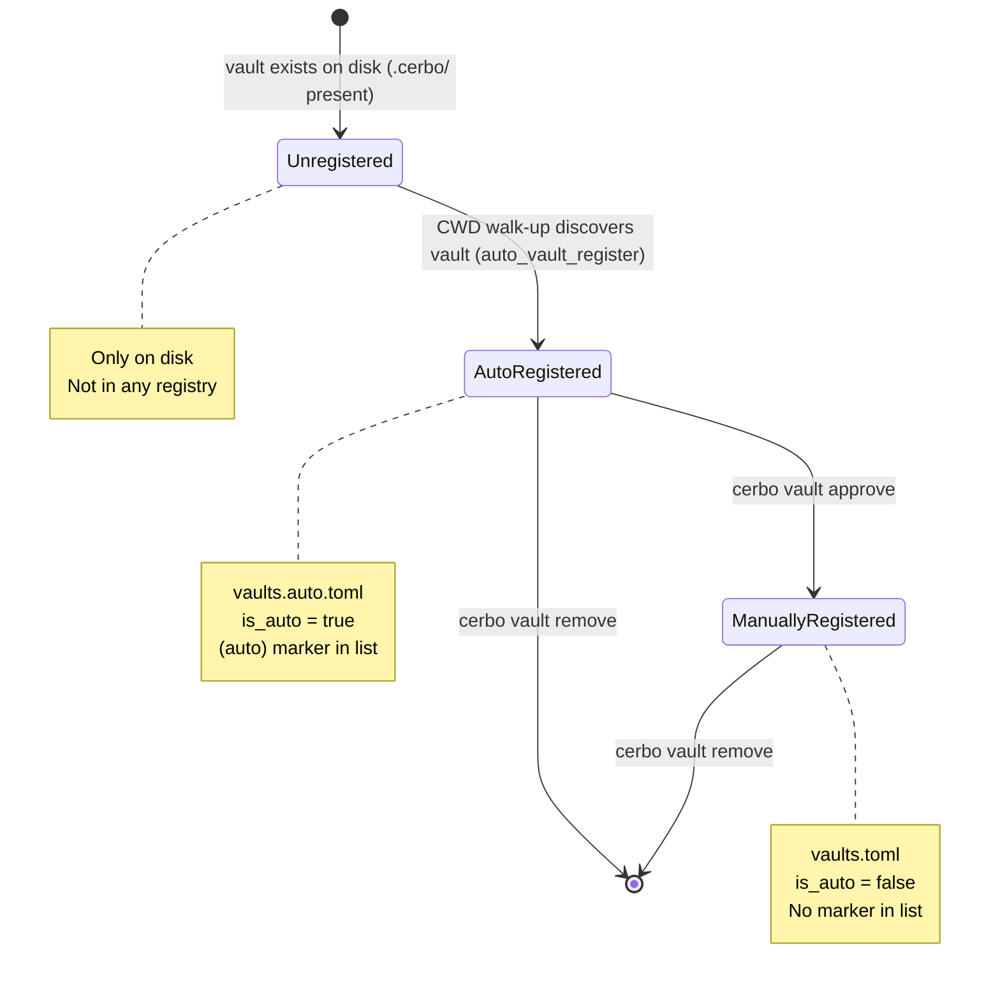
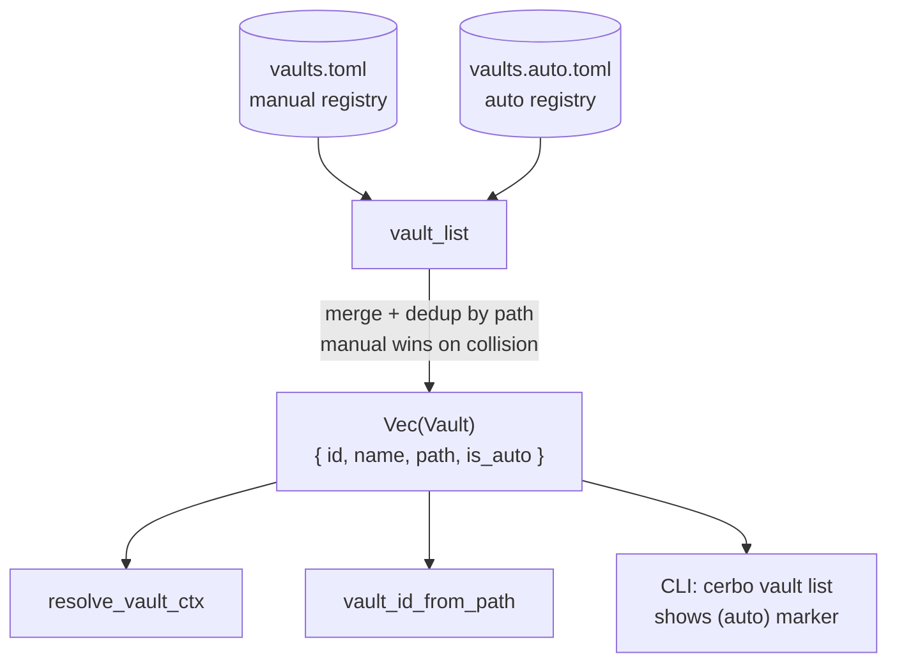

## Context

The `vault-cwd-auto-discovery` change wired CWD walk-up into every command. When a vault is found on disk but not in `vaults.toml`, the CLI currently warns and continues. This change eliminates the warning by silently recording the vault in a separate `vaults.auto.toml` file. Callers get a unified `vault_list` that merges both files; the two backing files remain independent so user-curated entries are never touched by automation.

Current data model:
- `vaults.toml` → `Config { vaults: Vec<Vault> }` — manually registered
- `Vault { id, name, path }` — no flag distinguishing origin

## Goals / Non-Goals

**Goals:**
- Auto-register CWD-discovered vaults in `vaults.auto.toml` (XDG config dir)
- `vault_list` returns a single unified `Vec<VaultEntry>` with `is_auto: bool`
- `cerbo vault approve <id>` promotes auto → manual
- `cerbo vault list` shows `(auto)` marker for auto-registered entries
- All existing consumers of `vault_list` continue to work without changes

**Non-Goals:**
- Filesystem scans for vaults outside CWD walk-up
- Auto-merging the two files
- Desktop/Tauri changes
- Changing vault ID scheme or `vaults.toml` format

## Decisions

### Decision 1 — Add `is_auto` to `Vault`, keep one public type

Extend `Vault` with `pub is_auto: bool` (defaults to `false` via `#[serde(default)]`). `vault_list` merges entries from both files, setting `is_auto = true` for auto entries. All callers use the same type — no parallel `AutoVault` struct.

**Alternative considered:** separate `AutoVault` struct. Rejected — doubles the type surface and requires callers to merge.

### Decision 2 — `vaults.auto.toml` mirrors `vaults.toml` schema

Use the same `Config { vaults: Vec<Vault> }` TOML shape for `vaults.auto.toml`. A new `auto_config_path` helper returns `config_dir/vaults.auto.toml`. No new serde types needed.

**Alternative considered:** single file with a `[auto]` section. Rejected — TOML section mixing is awkward and risks accidental writes.

### Decision 3 — `vault_list` merges both files, manual entries take precedence

If a vault path appears in both files (e.g. user ran `vault add` for an already-auto vault), the manual entry wins and the auto entry is silently dropped from the returned list. `vault_approve` formalises this: it adds to `vaults.toml` and removes from `vaults.auto.toml`.

### Decision 4 — `vault_id_from_path` searches the unified list

`vault_id_from_path` already calls `vault_list`. After this change it automatically covers auto-registered vaults with no modification needed.

### Decision 5 — Auto-registration is idempotent and silent

If the vault is already in `vaults.auto.toml` (same path), the write is skipped. No output to stderr. The "not registered" warning from `vault-cwd-auto-discovery` is removed.

### Decision 6 — `vault approve` subcommand for promotion

`cerbo vault approve <id>` reads the auto entry by ID, appends it to `vaults.toml` (clearing `is_auto`), removes it from `vaults.auto.toml`. Errors if the ID is not in auto list or already in manual list.

#### Vault registration lifecycle



```
ASCII fallback:

  [disk only]
      │ CWD walk-up
      ▼
  [auto-registered]  ──approve──►  [manually registered]
  vaults.auto.toml                 vaults.toml
  is_auto=true                     is_auto=false
      │ vault remove                    │ vault remove
      ▼                                 ▼
   [gone]                            [gone]
```

#### vault_list merge architecture



```
ASCII fallback:

  vaults.toml          vaults.auto.toml
  (manual)             (auto)
      │                     │
      └──────┬──────────────┘
             ▼
         vault_list()
         merge + dedup
         (manual wins)
             │
    Vec<Vault { is_auto }>
             │
    ┌────────┼─────────────┐
    ▼        ▼             ▼
resolve_  vault_id_    vault list
vault_ctx from_path    (auto) marker
```

## Risks / Trade-offs

- **Stale auto entries** (vault directory deleted/moved) → `vault_list` could return paths that no longer exist. Mitigation: callers that need the path to exist already handle missing vaults; no extra handling needed here. A future `vault gc` command could prune stale entries.
- **ID collision** between auto and manual vaults is impossible — IDs are UUIDs generated at registration time; separate files mean no shared ID space.
- **`vaults.toml` compatibility** — adding `is_auto` with `#[serde(default)]` is fully backward-compatible; existing files deserialise without the field and get `false`.

## Migration Plan

No migration needed. Existing `vaults.toml` files deserialise cleanly. `vaults.auto.toml` is created on first discovery.

## Open Questions

None.
