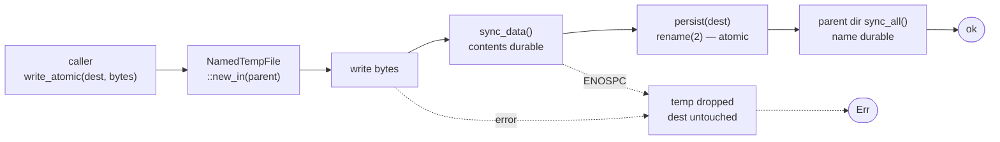

## Context

See `proposal.md` → Why for motivation, and `docs/store-model-review.md` for the full
evidence. Design-relevant constraints only:

- **`core` is the single writer.** Both `cerbo` (CLI) and `cerbo-desktop` (Tauri) go
  through `cerbo-core`, so one helper in `core` fixes every entry point at once.
- **Atomic-write discipline already exists** and is correct in `config.rs:31-34`,
  `state.rs:35-38`, `ui_settings.rs:52-54`, `vault.rs:60-63`. Four hand-rolled copies of
  tmp+rename, none applied to user content. This change extracts one helper and extends it.
- **`.ttl` is hand-rolled both ways.** Writers use `format!` (`object.rs:78-110`,
  `links.rs:112-140`, `annotations.rs:66-95`); readers use a `line.contains(...)` chain
  (`object.rs:125-158`). The write side and read side must change together.
- **`index.json` has no readers.** Verified: `index_resolve_title`, `index_resolve_uuid`,
  `index_remove` have zero call sites. The only external reader is
  `migrate/src/main.rs:358`, which this change deletes.
- **Nothing is verifiable yet.** `cargo test -p cerbo-core` fails 4–8 of 77 at random;
  `cargo clippy --workspace --all-targets` hard-fails; `nix build` sets `doCheck = false`.
  Gate repair must land **first**, or every fix below is unverified.
- `edition = "2024"`, `rustc 1.94.1`, `tempfile` present as dev + optional dependency.

## Goals / Non-Goals

**Goals**

- One write path for all vault mutations, enforced mechanically rather than by convention.
- Make the `meta.ttl` defect class *unrepresentable*, not merely test-guarded — no
  `format!`-built RDF anywhere.
- Recover already-damaged pages with no file rewrite and no migration step.
- Remove `index.json` and `migrate/` without changing any observable behaviour.

**Non-Goals** (beyond `proposal.md` → Non-goals)

- No new abstraction over the object store. This change edits existing functions in place;
  the five near-identical create bodies (`object.rs:205,255,336,381,814`) are consolidated
  only insofar as they must route through the new write helper.
- No async. `core` stays synchronous; `oxttl`'s Tokio support goes unused.
- No `CerboContext`/`VaultContext` unification, tempting as it is.
- No change to `page.md` bytes, ever. This change never rewrites user content.

## Decisions

### D1. One `core::fsio::write_atomic`, using `tempfile`

```rust
// core/src/fsio.rs
pub fn write_atomic(dest: &Path, bytes: &[u8]) -> io::Result<()>
```

Protocol: `NamedTempFile::new_in(dest.parent())` → write → `as_file().sync_data()` →
`persist(dest)` → open parent dir and `sync_all()`.

Temp file in the *same directory* is required — `persist` uses `rename(2)`, which is only
atomic within one filesystem. `sync_data()` before `persist` is required because
`tempfile` synchronises neither contents nor the containing directory on its own
([tempfile docs](https://docs.rs/tempfile/latest/tempfile/struct.NamedTempFile.html)). The
parent-directory `sync_all()` after the rename is what makes the new name survive power
loss ([crash-consistency background](https://0xkiire.com/crash-consistency-fsync-rename/)).

*Alternatives considered.* `atomic-write-file` 0.3.1 implements exactly this
(`fsync(fd)` then `rename`, temp file in the destination directory —
[docs](https://docs.rs/atomic-write-file)) and would be a defensible dependency. Rejected
because `tempfile` is already in the dependency tree and the helper is ~20 lines, so the
crate buys no code we do not already have to review. `esl01-atomicfile` was also
considered and rejected as a less-maintained equivalent. Writing in place with `fs::write`
plus a `.bak` copy was rejected outright: it doubles the window rather than closing it.

*Enforcement.* A convention will drift back across five near-identical create bodies, so
CI greps for `fs::write`/`File::create` under `core/src` outside `fsio.rs` and fails the
build. `fsio.rs` itself is the single allowed exception.

*Scope note.* `write_atomic` closes the **torn-write** window. It does **not** make
read-modify-write sequences (`backrefs_add`, and formerly `index_add`) race-free — two
processes can still both read, both write, and lose one update. That needs the vault lock,
explicitly deferred in `proposal.md` → Non-goals. Deleting `index.json` removes one such
sequence outright; the backref one is narrowed by removing the duplicate diff (D4) but
survives this change. Say so in the release notes rather than implying it is fixed.



```
caller ──▶ tmp in same dir ──▶ write ──▶ sync_data ──▶ rename ──▶ fsync(parent) ──▶ Ok
                │                                                                    
                └── any failure ──▶ temp file dropped, dest still holds old content ──▶ Err
```

### D2. `oxttl` + `oxrdf` for both writing and reading `.ttl`

`rio_turtle` is dropped. It is declared at `core/Cargo.toml:19` with zero `use` sites, and
upstream marks Rio unmaintained, directing users to `oxttl`/`oxrdfio`
([rio README](https://github.com/oxigraph/rio),
[lib.rs: "minimal maintenance"](https://lib.rs/crates/rio_turtle)). Replacing it with the
maintained successor from the same project is also what keeps the Oxigraph path in
`design.md:45-48` of the original change open, since `oxttl` is Oxigraph's own parser
([oxttl](https://docs.rs/oxttl), [oxrdf](https://docs.rs/oxrdf)).

Versions verified against the registry: `oxttl = "0.2.4"`, `oxrdf = "0.3.4"`.

**Both directions must change together.** Serialising with a real library while still
parsing with `line.contains(":type :")` would leave the brick defect intact — the read side
*is* the bug (`object.rs:127`). So:

- `ObjectMeta::to_turtle` builds `oxrdf` triples and serialises via `oxttl`. Escaping stops
  being our problem. Subject becomes the real `<cerbo://objects/{uuid}>` — which means
  `to_turtle` needs the UUID, currently absent from `ObjectMeta`; thread it through as a
  parameter rather than storing it, so the struct keeps one source of identity.
- `ObjectMeta::from_turtle` matches on parsed predicate IRIs. A title of
  `RDF :type :Source notes` is then a literal object and can never be read as a type.
- `cerbo:` gets declared alongside `:`, `schema:`, `xsd:`.

*Alternatives considered.* Keep `format!` and add a hand-rolled `escape_turtle_literal` —
rejected: it fixes today's five writers but leaves the next field one `format!` away from
reintroducing the class, and does nothing about the `contains`-based reader. Move metadata
to `meta.json` with serde — structurally stronger and genuinely tempting, but rejected by
the owner's decision to keep the RDF direction real; recorded in
`docs/store-model-review.md` §7.1 should that reverse.

*Recovery is free.* `to_turtle` writes `:type` on its own line (`object.rs:83`) with the
injected title on the next (`:84`), so a correct parser reads already-damaged files
correctly. **No migration, no fsck pass, no file rewrite** — the page un-bricks on next
read. This is why the parser change must not be paired with a "canonicalise `meta.ttl` from
parsed fields" repair: for a damaged page the old parser yields type `Source` and an empty
title, so canonicalising would faithfully re-emit `:type :Source` and certify the brick.

### D3. Delete `index.json` rather than harden it

It is simultaneously the O(N)-per-create hotspot and an unlocked read-modify-write that
self-destructs on a parse error. Hardening it means fixing both for a file with no readers.

The five specs that describe it (`slug-resolution`, `wikilink-editing`, `vault-init`,
`vault-management`, `page-crud`) specify a resolution mechanism **that was never
implemented** — resolution already works by scanning `meta.ttl`. So the spec deltas describe
what the code does today; no behaviour changes. Any future lookup cache must be rebuildable
and must live outside the vault.

*Alternatives considered.* Keep it and add tmp+rename plus a rebuild path — rejected: work
spent on a file nothing reads. Keep it and wire up the three dead resolvers — rejected: that
is new feature work with a data-loss profile, and the scan it would replace is already
correct.

### D4. Backref changes are the three cheap ones only

- Delete the duplicate diff at `links.rs:179-188`; `object_write` already calls
  `update_backrefs` (`object.rs:535`). Halves per-save I/O and the race window.
- `write_backrefs_to_path` must not `create_dir_all` a missing object (`links.rs:112-114`).
  The correct guard already exists at `metadata_index.rs:96-101` — reuse it. Also
  `Uuid::parse_str` the extracted id before it becomes a path segment.
- `index_vault` accumulates `HashMap<target, BTreeSet<source>>` in one scan and writes each
  target once, replacing the Phase-2 clear-all (`metadata_index.rs:45-53`). Removes the
  window where an interrupted reindex leaves backrefs erased, and the multi-GB hub case.

`update_backrefs`' discarded result (`object.rs:535`) and the `let _ =` at `:573` start
propagating. Not deferred: they are what makes §4.2's stale backrefs invisible.

`index --page` convergence stays out of scope — it needs an outbound-link record, which is a
data-model addition. `annotations.rs:81-86`'s replace-all terminator disappears for free,
since `oxttl` emits terminators.

### D5. Gate repair lands first

Ordering is a correctness matter, not tidiness: nothing else in this change is verifiable
until `cargo test` is green and clippy passes.

- Per-test `TempDir` replaces the two fixed paths (`object.rs:592` → `temp_dir()/cerbo_test`,
  `links.rs:200` → `temp_dir()/cerbo_test_links`). Tests within a module currently race each
  other, which is why the failure count moves between runs.
- Delete `[test] threads = 1` from **both** `.cargo/config.toml` and
  `core/.cargo/config.toml`. `[test]` is not a Cargo config table; it has never had any
  effect, and leaving it in place invites the wrong diagnosis again.
- `test-core.sh:1` → `#!/usr/bin/env bash` (`/bin/bash` does not exist on NixOS).
- Fix `migrate/src/main.rs:295` — moot once D6 deletes the crate, but sequence D6 before
  clippy is turned on rather than fixing a file that is about to disappear.
- `nix/pkgs.nix:13` → `doCheck = true`, last, once the suite is actually green.

### D6. Delete `migrate/` outright

`docs/storage.md:155` already states old vaults are incompatible and users must create new
vaults and migrate content by hand. The crate therefore contradicts shipped policy while
being the repo's most destructive code (`remove_dir_all` of the user's originals at
`main.rs:227` **before** the link-conversion pass) and the sole clippy blocker.

It also writes outbound `:linksTo` into the source (`:308-329`) while `core` reads inbound
`:hasBacklink` from the target — so a migrated vault reports zero backlinks until
`cerbo index`, which then deletes the migrator's output. It has never worked end to end.

*Alternatives considered.* Harden it (backup instead of delete, fix the regex, emit
`:hasBacklink`, add an end-to-end test) — rejected as investment in a path the docs already
disown. Quarantine behind a feature flag — rejected: keeps dead destructive code and the
maintenance question open. Removal also drops the last external reader of `index.json`,
making D3 a clean cut.

## Risks / Trade-offs

| Risk | Mitigation |
|---|---|
| `write_atomic` changes ownership/permissions of existing files, since `persist` replaces the inode | Copy the destination's mode onto the temp file before `persist`; add a test asserting mode is preserved across a rewrite |
| `sync_data` + directory `fsync` per save is slower — measurable on a debounced autosave firing per keystroke | Correctness wins over autosave latency for a tool holding the only copy. If it bites, lengthen the debounce; never drop the fsync |
| `NamedTempFile` leaves `.tmp*` siblings inside `.cerbo/objects/<uuid>/` after a crash | Name them with a known prefix and make `page_list`, `build_plan`, and reindex ignore it (`object-trash` and `durable-writes` specs both require this) |
| `oxttl` serialisation is not byte-identical to today's `format!` output, so the first write of every object produces a diff | Bounded and one-time; `page.md` is untouched. Land it in one release and say so in the notes rather than staging a rewrite pass |
| `oxttl` 0.2.x is pre-1.0 and has renamed its API recently (`FromRead`→`Reader`, `unchecked`→`lenient`) | Pin `=0.2.4`; confine all `oxttl` use to `ObjectMeta`/`links`/`annotations` serialisation so an upgrade touches three files |
| Escaping now round-trips characters the symlink layer cannot represent — a title with `/` or a newline reaches slug generation | Out of scope here, but assert current behaviour in a test so the interaction is documented rather than discovered later |
| Deleting `migrate/` strands anyone with a genuine pre-UUID vault | The last release that could convert one remains in git history; `docs/storage.md:155` already told users to migrate by hand. Note the tag in the release notes |
| Trash grows unbounded and is easy to miss | `object-trash` spec forbids auto-pruning; `cerbo init` adds `/.cerbo/trash/` to `.gitignore`. Surfacing trash size belongs to the deferred `cerbo fsck` |
| Propagating previously-swallowed backref errors turns silent partial saves into visible failures, which may read as a regression | Intended. Word the errors to say which part failed and that content was written |

## Migration Plan

No vault migration. Sequenced so each step is verifiable when it lands:

1. **Gates** (D5 + D6) — delete `migrate/`, per-test `TempDir`, remove both dead `[test]`
   stanzas, fix the shebang. `cargo test` and clippy green; `doCheck = true` last.
2. **`fsio::write_atomic`** (D1) — introduce, route `object.rs:528` and `page.rs:90` first
   (the two that can destroy a note), then the remaining writers, then add the CI grep.
3. **Turtle** (D2) — writers and readers together, in one commit. Regression tests:
   `RDF :type :Source notes`, `He said "hi"`, embedded newline, `C:\temp — заметки 🎉`,
   and byte-stability of an unchanged rewrite.
4. **`index.json` removal** (D3) — delete `core/src/index.rs`, the five `let _ = index_add`
   call sites, and the `fixtures.rs` uses; stop creating it in `cerbo init`.
5. **Backrefs + trash** (D4, `object-trash`) — existence guard, duplicate-diff removal,
   batched `index_vault`, `remove_dir_all` → rename into `.cerbo/trash/`.
6. **Docs** — `README.md` (drop the `cargo run --package cerbo-migrate` section at :98-108),
   `docs/storage.md` (currently silent on the symlink layer), `cli/man/cerbo.md`.

**Rollback.** Steps 1–5 are independent commits, each revertible on its own. Only step 4 is
observable in the vault (`index.json` stops being written); reverting it re-creates the file
from scratch with no data loss, because nothing reads it. Step 3 needs no rollback path for
data: `meta.ttl` written by `oxttl` is valid Turtle, and the old `contains`-based parser
would still find its predicates on separate lines — but do not rely on that, revert the
commit instead.

**Vaults in the wild.** A stale `.cerbo/index.json` is ignored, never read, and may be
deleted by hand. `meta.ttl` is rewritten to valid Turtle on the object's next write. Pages
bricked by a `:type`-injected title recover on next read with no user action.

## Open Questions

- Retention UX for `.cerbo/trash/`: a `cerbo trash list|restore|empty` command, or leave it a
  plain directory the user manages with `mv`? The `object-trash` spec deliberately fixes the
  on-disk contract and not the CLI surface, so this can be answered when `cerbo fsck` is
  designed without reopening any spec here.
- Whether the CI guard should be a grep or a clippy `disallowed_methods` lint. Same effect;
  the lint is cleaner but needs `clippy.toml` and only covers method paths it can name.
  Decide while implementing step 2.
